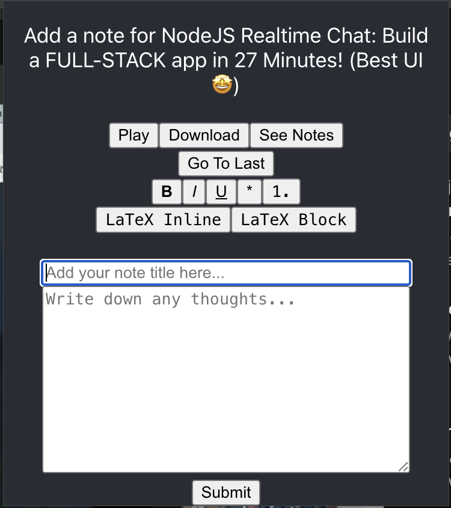

# YouTube Notetaker
> A Chrome Extension designed to enhance the video and notetaking experience by allowing one to effortlessly record and export annotations through an effective medium

## Features
* Auto-pause and unpause when writing down annotations
* Pure-JS rich text editor that allows ease of notetaking
* Export all annotations in a well-formatted markdown file that records your notes, the timestamp, and the video title
* View and manage all unfinished annotations

## Installation
1. Download all the files in the repository
1. Go to `chrome://extensions`
1. Enable developer mode
1. Go to `Load unpacked`
1. Select the folder containing files to this repository

## How to Use
1. Open any YouTube video
1. Click on the Chrome Extension icon
1. Write an annotation title and body, using markdown syntax
1. Submit the annotation
1. Repeat the process until the notetaking process is complete, and download the annotations to be viewed in a Markdown viewer.

## Roadmap
- [ ] Design custom icon
- [ ] Real-time markdown rendering in rich text editor
- [ ] Enhance UI design
- [ ] Allow annotation editing after it gets submitted
- [ ] Enhance error handling
- [ ] Expand idea limitations to beyond YouTube videos

## Technologies Used
* ReactJS
* [lxieyang's Chrome Extension Boilerplate](https://github.com/lxieyang/chrome-extension-boilerplate-react)

## Attributions
[Stock Notebook and Pen Vector and Icon](https://vectorportal.com/vector/notebook-and-pen/34873) used under CC 4.0.

## Demo
Coming soon...
